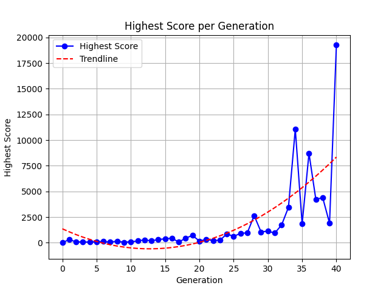

# FlappyBord AI

This is a from the ground up implementation of a simple feed forward neural network that learns how to play Flappy Bird
through neuroevolution.
To recreate evolution a simple algorithm was used, and the neural net's shape remains constant, only the values inside
it are tweaked.

---

## Features

- Real-time graph view of evolution
- Saving the best performing network to a binary file for later use
- Easy to run "experiments", allowing quick and simple testing of various network and evolution configurations
- Headless mode and fine control over speed

## Example


This example graph shows a basic series of generations evolving to reach a highscore
of 20000 points. The performance of these networks and evolution is dependent on various
factors you can configure yourself (see below).

## Running FlappyBord

To run FlappyBord yourself, clone this repo and build it with CMake. This will also download Raylib if it is not already
present on your system.
Once you have it setup, the best way to use it is to compile it and run `experiment.py`. This Python script will handle
launching the executable and the `visualizer.py` script for you to track the evolution over time.

### Running an Experiment

To set up a new experiment, it is recommended to create a directory `experiments/your_experiment` in `scripts`.
Then, simply create a new config using the `config.example.txt` provided and adjust the values to your liking.
These are the config values available to you:

| Field           | Description                                                                                                                                    |
|-----------------|------------------------------------------------------------------------------------------------------------------------------------------------|
| brainShape      | The "shape" of the neural network powering the Bords. Pass as (e.g.) 4,8,8,1.*                                                                 |
| logFile         | The file where each generation's best score will be logged (for the visualizer)                                                                |
| networkBin      | Where the best neural network should be saved to. If this file exists, it will be loaded and the initial Bords will use this as their network. |
| frameRate       | The framerate and update rate to run at                                                                                                        |
| mutationRate    | The % value for the upper / lower bound to mutate values by (0.0-1.0)                                                                          |
| mutationChance  | The chance to mutate any given value (0.0-1.0)                                                                                                 |
| bordCount       | The amount of Bords each generation should contain                                                                                             |
| percentToEvolve | What percentage of Bords should be picked to evolve (top X%) (given as 0-100)                                                                  |
| headless        | `true` or `false` -> run in headless mode                                                                                                      |

*The brain **must** have exactly 4 input neurons. The output layer can be any size, however only the first one is used.

To start the experiment, simply run `experiment.py` with two arguments:

```
python experiment.py <path_to_flappybord_exe> <config_file>
```

This will start the FlappyBord executable as well as the visualizer script to observe real-time behavior.